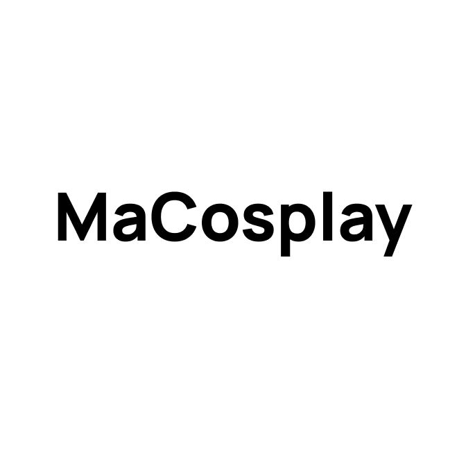

# MaCosplay - Open Source Cosplay Platform

<p align="center">
  
</p>

<p align="center">
  <a href="https://macosplay.com">Website</a> •
  <a href="https://github.com/idea2547/MaCosplay">Source Code</a> •
  <a href="https://discord.gg/vbrKE7WCXZ">Discord</a> •
  <a href="https://www.facebook.com/profile.php?id=61571822900726">Facebook</a>
</p>

<!-- Tech Stack Badges -->
<p align="center">
  <a href="https://kit.svelte.dev/"></a>
  <a href="https://pocketbase.io/"></a>
  <a href="https://tailwindcss.com/"></a>
  <a href="https://daisyui.com/"></a>
  <a href="https://pages.cloudflare.com/"></a>
</p>

<!-- GitHub Badges -->
<p align="center">
  <a href="https://github.com/idea2547/MaCosplay/stargazers"></a>
  <a href="https://github.com/idea2547/MaCosplay/network/members"></a>
  <a href="https://github.com/idea2547/MaCosplay/issues"></a>
  <a href="https://github.com/idea2547/MaCosplay/blob/master/LICENSE"></a>
</p>

<!-- Social Badges -->
<p align="center">
  <a href="https://discord.gg/vbrKE7WCXZ"></a>
  <a href="https://www.facebook.com/profile.php?id=61571822900726"></a>
</p>

## 📖 Overview

MaCosplay เป็นแพลตฟอร์ม Open-Source สำหรับชุมชนคอสเพลย์ ที่เปิดให้ทดลองใช้งานแล้ว และมีผู้ลงทะเบียนกว่า 200 คน! 🎉

MaCosplay connects cosplayers looking to rent costumes with costume owners across Thailand. With easy-to-use features and secure transactions, you can list your costumes for rent or find the perfect outfit for events or photoshoots.

## 🚀 Motivation

MaCosplay was created to solve common challenges in the cosplay community:

- Limited access to high-quality costumes
- Difficulty finding specific character outfits
- High costs of creating one-time costumes
- Lack of a dedicated platform for cosplay resource sharing

By creating an open-source platform, we aim to build a thriving ecosystem where cosplayers can share resources, knowledge, and costumes.

## 🌟 Features

- **เช่าชุดคอสเพลย์**: ค้นหาและเช่าชุดคอสเพลย์ที่คุณชื่นชอบ
- **แชร์ไอเดีย**: แบ่งปันแพทเทิร์น, ไกด์, และเทคนิคการทำคอสเพลย์
- **ชุมชน**: เชื่อมต่อกับคอสเพลย์เยอร์ทั่วโลกและแชร์ผลงานของคุณ
- **ทรัพยากร**: เข้าถึงฐานข้อมูลของชุดคอสเพลย์และอุปกรณ์

## 🖼️ Screenshots

<p align="center">
  
  
</p>

## 🧩 Why Open Source?

- **การมีส่วนร่วมทั่วโลก**: นักพัฒนาทั่วโลกสามารถเข้ามาช่วยพัฒนาได้
- **ประโยชน์ต่อชุมชน**: คอสเพลย์เยอร์จะได้ใช้แพลตฟอร์มที่ดียิ่งขึ้น
- **การพัฒนาที่รวดเร็ว**: โปรเจกต์เติบโตและพัฒนาได้อย่างรวดเร็ว

## 💻 Tech Stack

| Component    | Technology           |
| ------------ | -------------------- |
| **Frontend** | SvelteKit            |
| **Backend**  | PocketBase           |
| **UI**       | DaisyUI, TailwindCSS |
| **Hosting**  | Cloudflare Pages     |

## 🛠️ Getting Started

### Prerequisites

- Node.js (v18 or higher)
- Yarn or npm
- Git

### Installation

```bash
# Clone the repository
git clone https://github.com/idea2547/MaCosplay.git
cd MaCosplay

# Install dependencies
yarn install

# Start the development server
yarn dev
```

### Environment Setup

Create a `.env` file in the root directory with the following variables:

```bash
PUBLIC_POCKETBASE_URL=your_pocketbase_url
```

## 📱 How to Use

1. **Create an Account**: Sign up on [MaCosplay](https://macosplay.com)
2. **Browse Costumes**: Search for costumes by character, series, or size
3. **Rent a Costume**: Select dates and make a request
4. **List Your Costume**: Add photos, description, and set your rental terms

## 🔍 API Reference

Our API documentation is available at [api.macosplay.com](https://api.macosplay.com) (coming soon).

## 🧪 Testing

```bash
# Run unit tests
yarn test

# Run e2e tests
yarn test:e2e
```

## 👥 How to Contribute

We welcome contributions from developers and cosplayers alike! Check out our [Contributing Guide](CONTRIBUTING.md) for detailed instructions on how to get started.

### Quick Start for Contributors

1. Fork the repository
2. Create your feature branch (`git checkout -b feature/amazing-feature`)
3. Commit your changes (`git commit -m 'feat: add some amazing feature'`)
4. Push to the branch (`git push origin feature/amazing-feature`)
5. Open a Pull Request

## 📜 Project Structure

This project follows the [SvelteKit project structure](https://svelte.dev/docs/kit/project-structure).

```
├── src/
│   ├── lib/           # Library code (components, utilities)
│   ├── routes/        # SvelteKit routes
│   └── app.html       # HTML template
├── static/            # Static assets
├── tests/             # Test files
└── package.json       # Project dependencies
```

## 🌐 Community

- [Discord](https://discord.gg/vbrKE7WCXZ) - Join our community chat
- [Facebook](https://www.facebook.com/profile.php?id=61571822900726) - Follow us for updates
- [GitHub Issues](https://github.com/idea2547/MaCosplay/issues) - Report bugs or request features

## 🔮 Roadmap

- [x] Launch MVP version
- [x] Reach 200+ registered users
- [ ] Add international language support
- [ ] Implement advanced search features
- [ ] Create mobile app version

## 👨‍💻 Team

- **Founder** - [idea2547](https://github.com/idea2547)
- **Lead Developer** - [Your Name](https://github.com/username)
- **UI/UX Designer** - [Designer Name](https://github.com/designer)

## 📝 License

This project is licensed under the MIT License - see the [LICENSE](LICENSE) file for details.

## 🙏 Acknowledgments

- Project backed by: Otakuspace
- Special thanks to all contributors and the cosplay community
- Inspired by the global cosplay community's needs

---

<p align="center">
  Made with ❤️ for cosplayers, by cosplayers (and developers)
</p>
